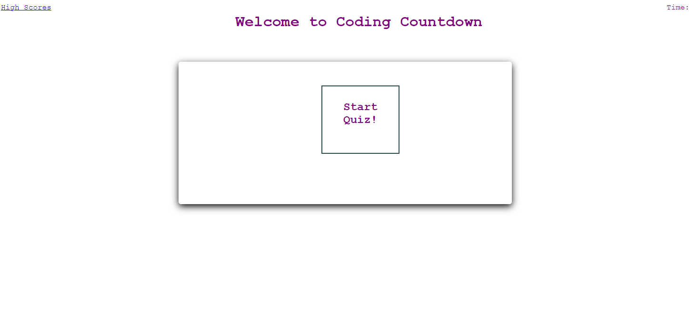
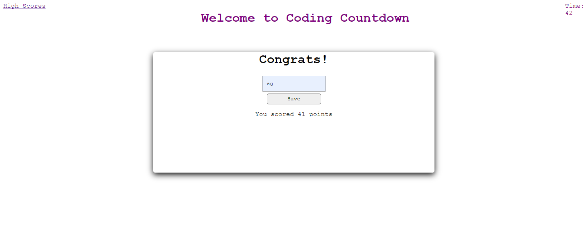

# JSQuiz
This was an attempt to make a quiz application using HTML, CSS, and JavaScript. The landing page for the application presents the user with a start button and an active high scores link in the nav (that will be populated from local storage after the quiz has been played).

I created various containers of content that I wanted to be visible or hidden at specific times in the html (start, quiz, score container, and high score container). This enabled me to use getElementById to modifiy the screen as I wanted and to get user input (clicks and text input). I used an array to generate the questions, and used a combinate of count and setInterval to create my timer display (which also doubled as the scoring mechanism).

I ended the exercise by using JSON to store (stringify) and retreive (parse) items in the local storage. Additionally, I used an arrow function for my high score display array, which returned the elements in list form using template literals. 

To test the program yourself, please go to the following url:
<https://segarrison.github.io/JSQuiz/>